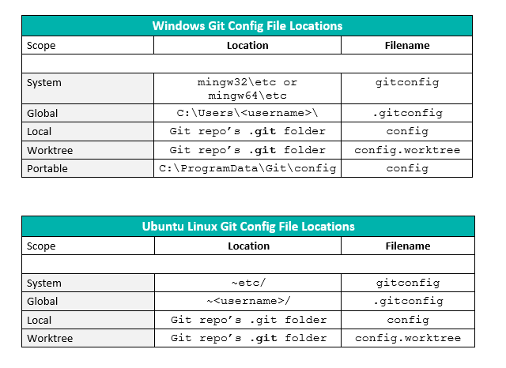

#gitconfig for git over SSH (NOT HTTPS)

- When you have multiple git accounts, the following setup automates git to push using the correct git credentials when in the respective folder (eg. githubUsername1Folder/repositoryName1).

- Create an SSH keypair `ssh-keygen -t rsa -b 4096` and upload the public key of the pair to your github account(s) before setting up the following configuration on your local machine

~/.gitconfig:		[documentation](https://git-scm.com/docs/git-config#_conditional_includes)
```  UseKeychain yes
git/githubUsername1Folder/"]
  path = ~/git/githubUsername1Folder/.gitconfig
[includeIf "gitdir:~/git/githubUsername2Folder/"]
  path = ~/git/githubUsername2Folder/.gitconfig

#the following entries are optional and can cause problems
[filter "lfs"]
      clean = git-lfs clean -- %f
      smudge = git-lfs smudge -- %f
      process = git-lfs filter-process
      required = true
```

~/git/githubUsername1Folder/.gitconfig:
```
[user]
	name = FirstName Surname
	email = username1@email.com
	username = usernam  UseKeychain yes

[core]
	sshCommand = "ssh -i ~/.ssh/username1privateSSHkey"
```
~/git/githubUsername2Folder/.gitconfig:
```
[user]
	name = FirstName Surname
	email = username2@email.com
	username = username2

[core]
	sshCommand = "ssh -i ~/.ssh/username2privateSSHkey"
```



See [this Howto](https://blog.gitguardian.com/8-easy-steps-to-set-up-multiple-git-accounts/) for more info


N.B. when cloning a repository be sure to use the SSH command, eg.: 
```
git clone git@github.com:username/wiki.git
```
If you use the https command, in the repository's `.git/config` file it will set:
```
[remote "origin"]
        url = https://etc etc
```

This means that each time you `git push` it will ignore your gitconfig and prompt you as follows:
```
Username for https://github.com:
```
