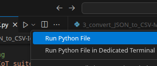
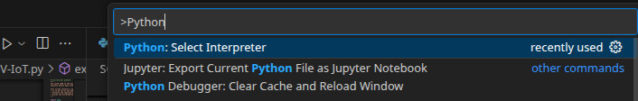

# python virtual environment setup instructions:

``` bash
python3 -m venv .venv
source .venv/bin/activate
pip install -r requirements.txt
```

#### To save python venv dependencies to the requirements.txt file run:

`pip freeze > requirements.txt`

## VSCode


To get VS Code to use your .venv virtual environment when pressing the 'run python file' button and generally when running Python files, follow these steps:

#### Method 1: Select Python Interpreter (Recommended)
- Open Command Palette: Ctrl+Shift+P (Linux/Windows) or Cmd+Shift+P (Mac)
- Type: Python: Select Interpreter
- Select your virtual environment: Look for the path that includes .venv, typically:
`./venv/bin/python`

