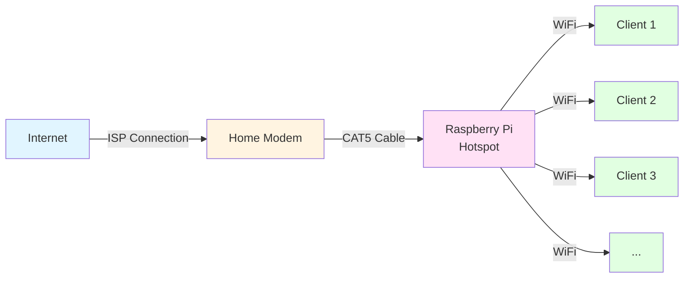

# VPN_raspi_hotspot

```mermaid
graph LR
    A[Internet] -->|ISP Connection| B[Home Modem]
    B -->|CAT5 Cable| C[Raspberry Pi<br/>Hotspot]
    C -->|WiFi| D[Client 1]
    C -->|WiFi| E[Client 2]
    C -->|WiFi| F[Client 3]
    C -->|WiFi| G[...]

    style A fill:#e1f5ff
    style B fill:#fff4e1
    style C fill:#ffe1f5
    style D fill:#e1ffe1
    style E fill:#e1ffe1
    style F fill:#e1ffe1
    style G fill:#e1ffe1
```

1. Download Raspi OS lite (64-bit)

2. https://raspberrytips.com/access-point-setup-raspberry-pi/

SSH

off-button

Further steps?:
    VPN