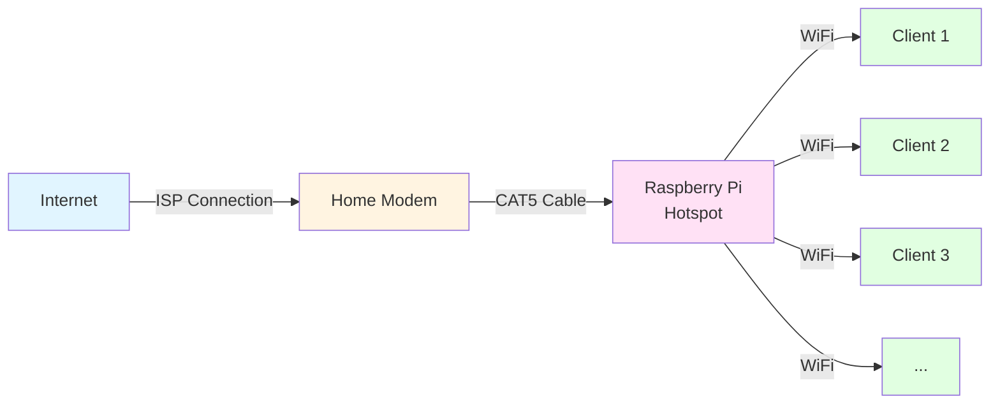

# VPN_raspi_hotspot

1. Download Raspi OS lite (64-bit)

2. https://raspberrytips.com/access-point-setup-raspberry-pi/

SSH

off-button

Further steps?:
    VPN

read this documentation on how wireguard should be deployed:
https://www.wireguard.com/quickstart/
https://github.com/pirate/wireguard-docs

take note on the following on how wireguard is deployed in order to use private internet access' VPN server(s):
https://github.com/pia-foss/manual-connections
https://github.com/triffid/pia-wg
https://github.com/derekn/piavpn-scripts
https://github.com/hsand/pia-wg
https://github.com/kchiem/pia-wg
https://forum.openwrt.org/t/private-internet-access-pia-wireguard-vpn-on-openwrt/155475/23?page=2
https://helpdesk.privateinternetaccess.com/guides/linux/alternative-setups-4/linux-manual-connection-scripts
https://helpdesk.privateinternetaccess.com/kb/articles/pia-desktop-command-line-interface-2
https://forum.mikrotik.com/t/private-internet-access-pia-wireguard-with-routeros/174081/2

examine how these raspi vpn hotspots are implemented:
https://www.xda-developers.com/how-use-raspberry-pi-vpn-whole-network/
https://raspberrytips.com/raspberry-pi-vpn-gateway/

and despite these using openVPN rather than wireguard, still take note of relevant aspects of their configuration:
https://medium.com/swlh/make-a-hotspot-of-raspberry-pi-while-using-a-vpn-e8f6620c1ab9
https://pimylifeup.com/raspberry-pi-vpn-access-point/
https://www.alexgladd.dev/posts/how-to-set-up-a-raspberry-pi-vpn-hotspot/
https://github.com/wmahfoudh/rpi-vpn-hotspot

i want to create two howto setup guides for raspi hotspots on raspi OS lite (64-bit). the first would be a basic hotspot like this:
https://raspberrytips.com/access-point-setup-raspberry-pi/
the second will be modular in that it uses most or all aspects of the first setup but additionally is a wireguard VPN gateway raspi hotspot. this second setup will implement safeguards to ensure that there are non DNS leaks along with a VPN killswitch (most likely implemented through firewall rules) and also an auto-reconnect feature which attempts reconnects if the VPN connection drops.
therefor, in creating the howto guide on the first simple raspi hotspot, ensure that the setup has architecture decisions which ensure that it is very similar to the second VPN hotspot and the second are modular add-on steps to the first simple raspi hotspot setup. 

both setups will have the same hardward setup as is explained in the mermaid diagram.

output the first howto guide in a new file called 'simple-hotspot.md'
output the second howto guide in a new file called 'wg-VPN-hotspot.md'