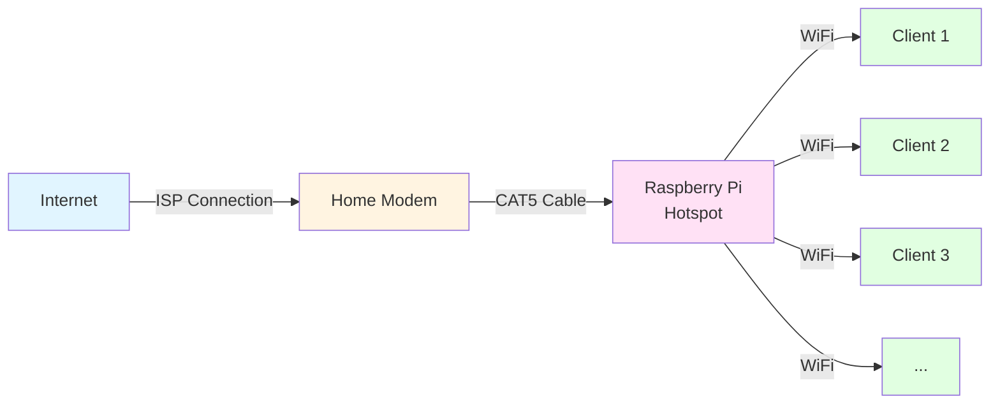

# 🌐 Simple Raspberry Pi Hotspot Setup Guide

A complete guide to setting up a basic wireless hotspot on Raspberry Pi OS Lite (64-bit) using NetworkManager.

## 📋 Table of Contents

- [🔌 Hardware Setup](#hardware-setup)
- [📦 Prerequisites](#prerequisites)
- [⚙️ Initial System Configuration](#initial-system-configuration)
- [🏗️ Network Architecture](#network-architecture)
- [📡 Hotspot Configuration](#hotspot-configuration)
- [🔥 Firewall and Routing Setup](#firewall-and-routing-setup)
- [✅ Testing and Verification](#testing-and-verification)
- [🔧 Troubleshooting](#troubleshooting)
- [✨ Optional Enhancements](#optional-enhancements)

---

## 🔌 Hardware Setup 

- ## � Prerequisites

### 💿 Download and Install Raspberry Pi OS

1. 📥 Download **Raspberry Pi OS Lite (64-bit)** from the official website:
- [Firewall and Routing Setup](#firewall-and-routing-setup)
- [✅ Testing and Verification](#testing-and-verification)
- [🔧 Troubleshooting](#troubleshooting)
- [✨ Optional Enhancements](#optional-enhancements)

---

## 🔌 Hardware Setup



### 🛠️ Required Components

1. **🍓 Raspberry Pi with Built-in WiFi** (any of the following):
   - Raspberry Pi 5 (recommended) ⭐
   - Raspberry Pi 4 Model B
   - Raspberry Pi 3 Model B/B+
   - Raspberry Pi 3 Model A+
   - Raspberry Pi Zero 2 W
   
2. **🔧 Additional Hardware**:
   - 🔌 CAT5/CAT6 Ethernet cable
   - ⚡ Power supply appropriate for your Pi model
   - 💾 MicroSD card (16GB minimum, 32GB recommended)

3. **🌐 Network Requirements**:
   - 📡 Home router/modem with available Ethernet port
   - 🌍 Internet connection

---

## 📦 Prerequisites

### Download and Install Raspberry Pi OS

1. Download **Raspberry Pi OS Lite (64-bit)** from [the official website](https://www.raspberrypi.com/software/operating-systems/):
   - View archive > Select most recent version > Download the following files:
      - *.img.xz / .torrent
      - *sha256
      - *.img.xz.sig
   - Get the key in order to verify the download: `gpg --keyserver hkp://pgp.rediris.es --recv-keys 0x54C3DD610D9D1B4AF82A37758738CD6B956F460C`
   - Verify the download: `gpg --verify [relase_date]-raspios-[version]-arm64-lite.img.xz.sig`
   - You should get something like this:
   ``` bash
   gpg: assuming signed data in '2025-10-01-raspios-trixie-arm64-lite.img.xz'
   gpg: Signature made Thu 02 Oct 2025 04:06:54 AM WEST
   gpg:                using RSA key 54C3DD610D9D1B4AF82A37758738CD6B956F460C
   gpg: Good signature from "Raspberry Pi Downloads Signing Key" [unknown]
   gpg: WARNING: This key is not certified with a trusted signature!
   gpg:          There is no indication that the signature belongs to the owner.
   Primary key fingerprint: 54C3 DD61 0D9D 1B4A F82A  3775 8738 CD6B 956F 460C
   ```
   - Extract the compressed file with **ONE** of the following two commands:
   ```
   unxz [relase_date]-raspios-[version]-arm64-lite.img.xz
   xz -d [relase_date]-raspios-[version]-arm64-lite.img.xz
   ```

2. 🖊️ Use **Raspberry Pi Imager** to write the image to your SD card:
   - Download `rpi-imager` from [the website](https://www.raspberrypi.com/software/) or use apt:
   ``` bash
   sudo apt install rpi-imager
   ``` 
   Create a key-pair for your pi by locally running: 
   ``` bash
   ssh-keygen -t rsa -b 4096
   cat keyname.pub
   ``` 
   Copy the public key to your clipboard
   - Start `rpi-imager`
   - Select OS: Use Custom (select your verified Raspberry Pi OS Lite `.img` file)
   - Select Storage: Your SD card (triple check you have selected the correct storage medium!!!)
   - ⚙️ Advanced options (gear icon):
     - ✅ Enable SSH
         - Allow public-key authentication only
            - Set authorized_keys for 'pi': [paste your entire public key in here]
     - 👤 Set username and password
     - 🌍 Configure WiFi country (important for hotspot functionality)
     - 🏷️ Set hostname (e.g., "raspberrypi-hotspot")
     - Disable telemetry

3. ✍️ Write the image and insert SD card into Raspberry Pi

### 🔌 Physical Connections

1. 🔗 Connect Ethernet cable between home router and Raspberry Pi
2. 💾 Insert SD card into Raspberry Pi
3. ⚡ Power on the Raspberry Pi
4. ⏳ Wait 2-3 minutes for first boot

---

## ⚙️ Initial System Configuration

### 🖥️ Connect via SSH

Find your Pi's IP address from your router's DHCP client list, or find it using CLI:
Find your network card's name and LAN/private IP adress
``` bash
ip a
```
Running `arp` usually finds what you need. You may need to install it using `sudo apt install net-tools`

But if you still cant find the pi's IP address, scan the gateway IP address that your network card and raspi are associated to. For example:
``` bash
sudo nmap -sn 192.168.1.100/24
```

Now youre ready to SSH into your pi
``` bash
ssh -i .ssh/raspi pi@<raspberry-pi-ip>
# or use the hostname you configured
ssh -i .ssh/raspi pi@raspberrypi-hotspot.local
```

### 🔄 Update System

``` bash
sudo apt update
sudo apt upgrade -y
```

### 🌍 Configure WiFi Country (if not done during imaging)

``` bash
sudo raspi-config
```

Navigate to:
- **Localisation Options** → **WLAN Country** → Select your country

⚠️ This step is **critical** - the WiFi interface will not be enabled until the country is set.

### 📶 Enable WiFi Interface

Verify WiFi is enabled:

``` bash
nmcli radio wifi
```

If it returns "disabled", enable it:

```bash
sudo rfkill unblock wifi
sudo nmcli radio wifi on
```

### ✅ Verify Network Manager

Raspberry Pi OS Bookworm (2023+) uses NetworkManager by default. Verify it's running:

```bash
systemctl status NetworkManager
```

---

## 🏗️ Network Architecture

### 🔍 Understanding the Setup

The Raspberry Pi will act as a bridge between two networks:

1. **🔌 Ethernet Side (eth0)**:
   - Connected to home router via cable
   - Receives IP via DHCP from router (e.g., 192.168.1.x)
   - Provides internet access

2. **📶 WiFi Side (wlan0)**:
   - Acts as access point for clients
   - Uses isolated subnet (e.g., 10.10.0.x)
   - Provides DHCP to connected devices

### 🔀 Enable IP Forwarding

IP forwarding allows traffic to flow between the two network interfaces:

```bash
sudo nano /etc/sysctl.d/routed-ap.conf
```

Add the following content:

```conf
# Enable IPv4 routing
net.ipv4.ip_forward=1
```

Apply the changes:

```bash
sudo sysctl -p /etc/sysctl.d/routed-ap.conf
```

Verify it's enabled:

```bash
sysctl net.ipv4.ip_forward
# Should return: net.ipv4.ip_forward = 1
```

---

## 📡 Hotspot Configuration

### 🎯 Create the Access Point with NetworkManager

NetworkManager in Bookworm makes hotspot creation straightforward using `nmcli`.

#### 1️⃣ Step 1: Create the Hotspot Connection

```bash
sudo nmcli con add con-name hotspot ifname wlan0 type wifi ssid "RaspberryPi-Hotspot"
```

**📝 Parameters explained**:
- `con-name hotspot`: Internal connection name (can be anything)
- `ifname wlan0`: Physical interface to use
- `type wifi`: Connection type
- `ssid "RaspberryPi-Hotspot"`: WiFi network name (change as desired)

#### 2️⃣ Step 2: Configure Security

Set WPA2 security with a password:

```bash
sudo nmcli con modify hotspot wifi-sec.key-mgmt wpa-psk
sudo nmcli con modify hotspot wifi-sec.psk "YourSecurePassword123"
```

⚠️ **Important**: Use a strong password with at least 8 characters.

#### 3️⃣ Step 3: Configure Access Point Mode

```bash
sudo nmcli con modify hotspot 802-11-wireless.mode ap 802-11-wireless.band bg ipv4.method shared
```

**📝 Parameters explained**:
- `802-11-wireless.mode ap`: Set interface to Access Point mode
- `802-11-wireless.band bg`: Use 2.4GHz band (bg = 802.11b/g/n)
  - For 5GHz: use `a` (requires compatible hardware and channel)
- `ipv4.method shared`: Enable IP sharing with built-in DHCP/DNS

#### 4️⃣ Step 4: Activate the Hotspot

```bash
sudo nmcli con up hotspot
```

### ✅ Verify the Hotspot

Check the connection status:

```bash
nmcli con show hotspot
```

Check active connections:

```bash
nmcli con show --active
```

View WiFi interface status:

```bash
ip addr show wlan0
```

You should see an IP address like `10.42.0.1` assigned to wlan0.

---

## 🔥 Firewall and Routing Setup

### 📦 Install iptables-persistent

This ensures firewall rules persist across reboots:

```bash
sudo DEBIAN_FRONTEND=noninteractive apt install -y netfilter-persistent iptables-persistent
```

### 🔄 Configure NAT (Network Address Translation)

NAT allows devices on the WiFi network to access the internet through the Ethernet connection:

```bash
sudo iptables -t nat -A POSTROUTING -o eth0 -j MASQUERADE
```

**💡 What this does**: Translates private WiFi IP addresses to the Pi's Ethernet IP address.

### ➡️ Add Forwarding Rules

Allow traffic to flow between interfaces:

```bash
sudo iptables -A FORWARD -i eth0 -o wlan0 -m state --state RELATED,ESTABLISHED -j ACCEPT
sudo iptables -A FORWARD -i wlan0 -o eth0 -j ACCEPT
```

### 💾 Save Firewall Rules

```bash
sudo netfilter-persistent save
```

### ✅ Verify Rules

```bash
sudo iptables -t nat -L -n -v
sudo iptables -L FORWARD -n -v
```

---

## ✅ Testing and Verification

### 🍓 From the Raspberry Pi

1. **🔍 Check interface status**:
   ```bash
   ip addr show
   ```
   - eth0 should have IP from your home router (e.g., 192.168.1.x)
   - wlan0 should have IP 10.42.0.1 or similar

2. **🌐 Test internet connectivity**:
   ```bash
   ping -c 4 8.8.8.8
   ```

3. **🔍 Check DNS resolution**:
   ```bash
   nslookup google.com
   ```

### 📱 From a Client Device

1. **📶 Connect to the hotspot**:
   - Look for "RaspberryPi-Hotspot" (or your SSID) in WiFi networks
   - Enter the password you configured

2. **✅ Verify connection**:
   - Check you received an IP in the 10.42.0.x range
   - Default gateway should be 10.42.0.1

3. **🌐 Test internet access**:
   - Open a web browser
   - Navigate to https://www.google.com
   - Try multiple websites

4. **🔍 Check your public IP**:
   - Visit https://whatismyipaddress.com
   - Should show your home internet's public IP

---

## 🔧 Troubleshooting

### ❌ Hotspot Not Visible

**🔍 Check WiFi is enabled**:
```bash
nmcli radio wifi
sudo rfkill unblock wifi
```

**🔄 Restart the hotspot connection**:
```bash
sudo nmcli con down hotspot
sudo nmcli con up hotspot
```

**📋 Check logs**:
```bash
journalctl -u NetworkManager -f
```

### ⚠️ Can Connect but No Internet

**✅ Verify IP forwarding**:
```bash
sysctl net.ipv4.ip_forward
# Should return 1
```

**🔍 Check firewall rules**:
```bash
sudo iptables -t nat -L -n -v
sudo iptables -L FORWARD -n -v
```

**🔄 Verify routing**:
```bash
sudo iptables -t nat -A POSTROUTING -o eth0 -j MASQUERADE
sudo netfilter-persistent save
```

### 🚫 Clients Can't Get IP Address

**🔄 Restart NetworkManager's DHCP**:
```bash
sudo systemctl restart NetworkManager
```

**📋 Check dnsmasq logs** (NetworkManager uses dnsmasq internally):
```bash
journalctl -u NetworkManager | grep -i dhcp
```

### 📶 WiFi Performance Issues

**🔍 Check for interference**:
```bash
sudo iwlist wlan0 scan | grep -E "ESSID|Channel|Quality"
```

**🔄 Change WiFi channel** (if needed):
```bash
sudo nmcli con modify hotspot 802-11-wireless.channel 6
sudo nmcli con up hotspot
```

### 📋 View All NetworkManager Settings

```bash
nmcli con show hotspot
```

---

## ✨ Optional Enhancements

### 📡 Change WiFi Band to 5GHz

If your Pi supports 5GHz (Pi 3B+, 4, 5):

```bash
sudo nmcli con modify hotspot 802-11-wireless.band a
sudo nmcli con modify hotspot 802-11-wireless.channel 48
sudo nmcli con up hotspot
```

**📝 Note**: Available channels for 5GHz vary by country. Check with:
```bash
iw list | grep -A 15 "Frequencies:"
```

### 🔒 Hide SSID (Hidden Network)

```bash
sudo nmcli con modify hotspot 802-11-wireless.hidden yes
sudo nmcli con up hotspot
```

### 🔢 Set Static IP for wlan0

If you want a specific IP instead of the default 10.42.0.1:

```bash
sudo nmcli con modify hotspot ipv4.addresses 192.168.4.1/24
sudo nmcli con modify hotspot ipv4.method shared
sudo nmcli con up hotspot
```

### 🌐 Configure DNS Servers

Use specific DNS servers (e.g., Cloudflare):

```bash
sudo nmcli con modify hotspot ipv4.dns "1.1.1.1 1.0.0.1"
sudo nmcli con up hotspot
```

### 📊 Monitoring and Logging

**👥 View connected clients**:
```bash
iw dev wlan0 station dump
```

**📈 Monitor traffic**:
```bash
sudo iftop -i wlan0
# Install if needed: sudo apt install iftop
```

### 🚀 Auto-start Hotspot on Boot

The hotspot should auto-start by default. To ensure it:

```bash
sudo nmcli con modify hotspot connection.autoconnect yes
```

### ⚡ Set Up Quality of Service (QoS)

Limit bandwidth for specific devices using `tc` (traffic control) - this is advanced and beyond the scope of this basic guide.

---

## 🚀 Next Steps

This hotspot is now ready to be extended with VPN functionality. See the companion guide **wg-VPN-hotspot.md** for instructions on adding WireGuard VPN with:

- 🔒 DNS leak protection
- 🛡️ VPN killswitch
- 🔄 Auto-reconnect functionality
- 🌐 Private Internet Access (PIA) integration

---

## 🛠️ Maintenance Commands

### 🔄 Restart the Hotspot

```bash
sudo nmcli con down hotspot
sudo nmcli con up hotspot
```

### 📊 View Hotspot Status

```bash
nmcli con show hotspot
nmcli -f GENERAL,IP4,WIFI-PROPERTIES dev show wlan0
```

### ⏸️ Disable Hotspot

```bash
sudo nmcli con down hotspot
sudo nmcli con modify hotspot connection.autoconnect no
```

### 🗑️ Delete Hotspot Configuration

```bash
sudo nmcli con delete hotspot
```

---

## 🏗️ Architecture Notes for VPN Extension

This setup has been designed with modularity in mind for VPN integration:

1. **🔀 Separate subnets**: WiFi (10.42.0.x) is isolated from home network
2. **🔄 NAT structure**: Makes it easy to redirect traffic through a VPN tunnel
3. **🔥 Firewall foundation**: iptables rules can be extended for VPN routing
4. **⚙️ NetworkManager integration**: Compatible with VPN connection management

The routing table and firewall rules established here will serve as the foundation for adding the VPN layer in the next guide.

---

## 📚 References

- [Raspberry Pi Documentation - Wireless Access Point](https://www.raspberrypi.org/documentation/configuration/wireless/access-point-routed.md)
- [NetworkManager Documentation](https://networkmanager.dev/)
- [nmcli Command Reference](https://developer.gnome.org/NetworkManager/stable/nmcli.html)
- [RaspberryTips - Access Point Setup](https://raspberrytips.com/access-point-setup-raspberry-pi/)

---

📅 **Last Updated**: November 2025  
✅ **Tested On**: Raspberry Pi OS Bookworm (64-bit), Raspberry Pi 4 Model B
